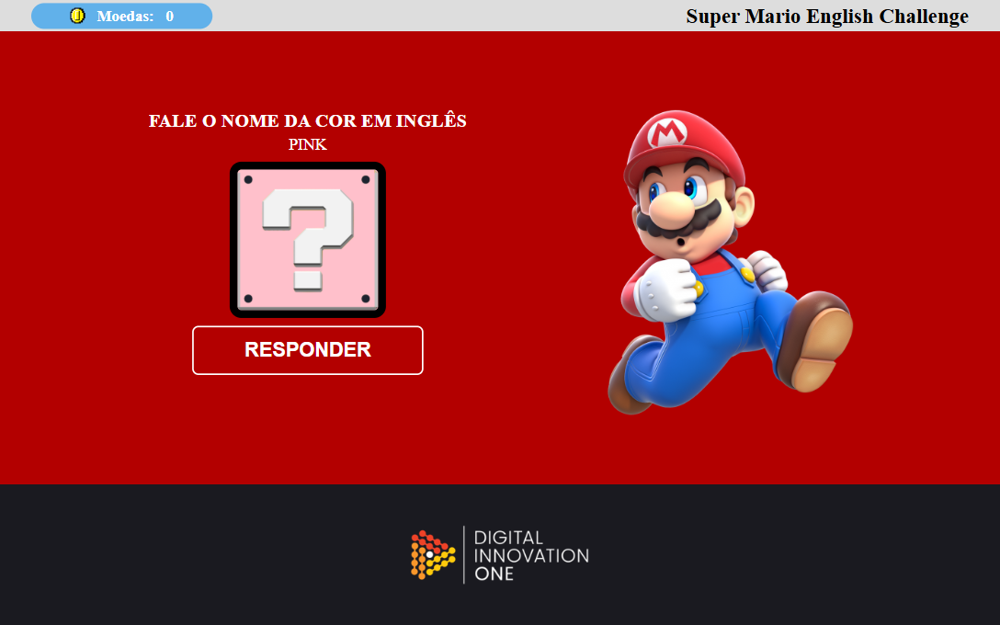
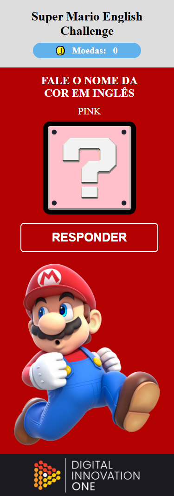

# 🎮 Super Mario English Challenge

## 🧠 Sobre o Projeto

Este projeto foi desenvolvido como uma atividade prática de HTML, CSS e JavaScript, com foco em acessibilidade, interatividade e uso da **API de reconhecimento de voz** do navegador. 

No jogo, o jogador deve **dizer corretamente o nome da cor em inglês** que aparece na tela. Ao acertar, ele ganha uma moeda (💰), ao errar, perde uma. O objetivo é praticar o vocabulário de cores em inglês de forma divertida e gamificada, com uma estética inspirada no universo do Mario.

## 📸 Prévia

### Versão Desktop

> *Imagem ilustrativa da versão desktop do jogo.*

### Versão Mobile

  
  
<em>Imagem ilustrativa da versão mobile do jogo.</em>

## 🚀 Funcionalidades

- 🎤 Reconhecimento de voz com a API `SpeechRecognition`
- 🎨 Exibição randômica de cores com fundo dinâmico
- 🧠 Prática de vocabulário em inglês com feedback instantâneo
- 💰 Sistema de pontuação com sons para acerto e erro
- 📱 Interface responsiva (mobile e desktop)
- 👾 Design com elementos visuais temáticos (Mario, moedas, etc.)

## 🛠️ Tecnologias Utilizadas

- **HTML5** semântico
- **CSS3** com media queries
- **JavaScript** puro (Vanilla JS)
- API `SpeechRecognition` (Web Speech API)
- Assets e ícones personalizados

## 🔗 Acesse o Projeto

👉 [Ver Projeto Online no GitHub Pages](https://luis-fellipe.github.io/projeto-js-jogo-comando-de-voz/)

## 💼 LinkedIn

Conecte-se comigo no [LinkedIn](https://www.linkedin.com/in/luis-fellipe-real)

---

